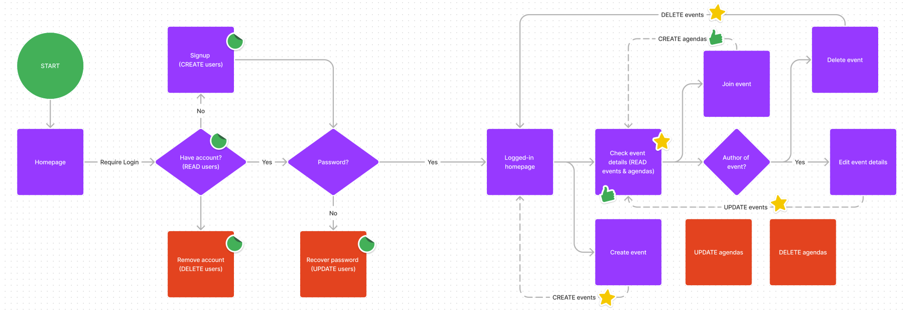

# Welcome to My Second App
Count Me In is a social app that allows people to create and join activities as groups. This app is made as an exercise to incorporate CRUD abilities (create, read, update, delete) into an app. It is deployed on render. The app can be accessed through this <a href="https://countmein.onrender.com/">link</a>.

# How does it work?
On the home page, user can see different activities created by users. Upon creation, users are given the option to add a title, description and image. After submission, the event will be available on the home page. 

When clicked, the event will show the details. Only the author can edit the event. Non-authors can still access the event's details page and open the expanded description. All logged-in users can press the 'Count me in' button to add themselves to the group. The number of people joined will be updated. 

# Draft and Flow Design

This flowchart is used as a guide in developing the app. The flowchart evolved and updated as the app developed. The flowchart also pinpoints the CRUD elements of the app with different 'stickers' for each element of the app. There are three different elements in the app that has the CRUD capabilities: user data, event data and agenda.

## User Data
User data is used to store user id and their encrypted (digested) password. User can CREATE an account by signing up and READ the account by logging in.

## Event Data
Event data is used to store events created by users. The author can CREATE, UPDATE and DELETE the event, while all other users, including the author can READ the event by browsing the home page and entering into the event's details page.

## Agenda
Agenda is a data group used to keep track of how many users joined the group and which users they are. The data pair the user id with the event's id. Users can CREATE a new agenda by signing up for an event by clicking the 'Count me in' button in the details page of an event, as well as READ their appointment. There is, however, no visual cues on which events the user has already registered in and the only way to check is by pressing the 'Count me in' button. If they are already signed up, they will be prompted on the screen. As of the current state, there is no function to withdraw from the event. 

# Technical Details

Dependencies used in this build are bcrypt, ejs, express, express-ejs-layouts, express session, memorystore, method-override and pg.

## Sign In and Log In

This feature is made by taking user input and put the password in bcrypt encryption before being saved into the database. There is no email verification feature yet so user can always make a new username and password without asked for further requirement. 

When a user sign up, the email will be checked if it exists in the database and if so, informed the user that the username already exists. Upon login, should the username and its designated password not match, user will be prompted of the wrong credential.

After a user sucessfully login, their id will be stored in the session. There are only a number of pages available to users without login details, but if they want to check the details or join an event, they need to login. There is a function in the app that checks if the user is logged-in before entering these pages. If not, they will be redirected to the login page.

## Creating, Editting and Removing Events

User can create an event, edit and remove events they created. When a user go to the event creation page, they will be checked if they are signed in. In the creation page, they can enter the title, description and an image url for their event. The description is capped at 200 words.

After they create an event, they can see the event posted on the home screen. There is a limit on how much of the description they can see from the home page by an elipsis function. The rest of the description can be accessed through the details page, which can be accessed by clicking the event card on the home page.

The details page also include the count me in, edit and delete button. While all users can see the count me in button, only the author have access to the edit and delete button. The delete button is inside the edit page.

## Count Me In
User can press the Count Me In button and register their attendance to the event. There is a function to detect whether the user has already counted in. If so, they will be informed on the screen. When a user counts in, the number of people joined will be updated.

# Notes
- Due to the app being deployed on render, the loading time may vary due to render's algorithm to put the server on sleep after a period of time.
- A message that there is no events created yet will appear if there is no event on the homescreen so the app does not crash when there is no events in the database.
- The description input bar could be bigger to indicate that the user can input long passage in it.
- The user's details are stored in the session object and therefore can be accessed almost anywhere in the app, allowing features such as displaying the username on the header.
- The css is responsive in smaller screen.
- The buttons and event cards are interactive on hover and click. Check it out!
- Last minute update: Now available on mobile devices.

    